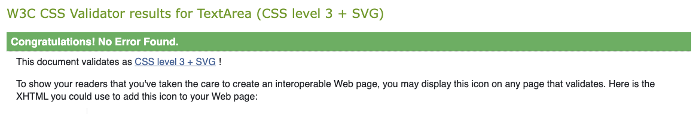

# Ristorante Amalfi - Restaurant Website

Portfolio 4 Assignment Submission

Live site can be found [here](-)

## Contents

- [Objectives](#objectives)
- [User Experience and UX Design](#user-experience)
    - [Target Audience](#target-audience)
    - [User Stories](#user-stories)
        - [Customer Goals](#customer-goals)
    - [Design](#design)
        - [Colour Scheme](#colour-scheme)
        - [Typography](#typography)
        - [Wireframes](#wireframes)
        - [Database](#database)
    - [Features](#features)
        - [Header](#header)
        - [Body](#body)
            - [Menu](#menu)
            - [Bookings](#bookings)
                - [Reservation](#reservation)
                - [Complete Booking](#complete-booking)
                - [Amend Booking](#amend-booking)
                - [Cancel Booking](#cancel-booking)
            - [Contact](#contact)
                - [EmailJS](#emailjs)
        - [Footer](#footer)
    -  [Technologies Used](#technologies-used)
        - [Programming Languages, Frameworks and Libraries](#programming-languages)
    - [Agile](#agile)
    - [Testing](#testing)
        - [Manual Testing](#manual-testing)
        - [User](#user)
        - [Bugs](#bugs)
        - [Lighthouse](#lighthouse)
        - [Validation](#validation)
            - [HTMl and CSS](#html-and-css)
            - [Python](#python)
        - [Deployment](#deployment)
            - [Heroku Deployment](#heroku)
            - [Github Deployment](#github)
            - [Creating a Fork](#fork)
            - [Clone](#clone)
        - [Credits](#credits)
        - [Media](#media)
        - [Acknowledgements](#acknowledgements)

## Objectives

- I was tasked with creating a restaurant booking website to showcase what I've learnt in the fast few modules.

- I intended to do this by using HTML, CSS, JavaScript, Python and SQL. 

## User Experience and UX Design

### Target Audience

- The target is part of a large demographic, anyone who loves Italian food and who whish to make a reservation online.

### User Stories

#### Customer Goals

- To be able to easily navigate through the website and not have to fumble their way through to find what they're looking for.

- To enquire through the use of a contact form to query anything that might not be clear on the website.

- Be able to make a booking seamlessly through the bookings page.

### Design

#### Colour Scheme

- I opted to have quite a simple colour scheme for this project as I didn't want to distract from the simplicity of the website. I chose muted colours over vibrant ones, but still managed to make the site colourful. 

- I used #223843 for the header and the footer as I felt this gave a professional look while still being exciting. 

- For the font colour on the header and footer I went simple and used #ffffff to blend in and not be distracting for the user. I also used this for the background of the body.

- #D77A61 was used for the buttons on the website to make it clear that these weren't to be missed. I also used this colour as an accent by creating and bottom border for the header and top border for the footer. The active site used this colour too and when the navigation links were hovered over they'd change to this colour. 

#### Typography

- For the typography I only used two fonts:
    - I used Poppins for the navigation brand, headings and meal titles on the menu page. 

- The other font was Roboto, this was used as my standard font for the website. Often seen in paragraphs of the navigation links. 

#### Wireframes

- Mobile Wireframe

- Tablet Wireframe

- Laptop Wireframe

#### Database

- I inted to have two classes within my database:
    - The first class the Reservation class and will be on the primary page to take the booking name. 
    - The second class will be the Customer class. Once their name has been taken they'll be directed to a page which will display their name. They'll then be able to add, amend or delete their details. 

### Features

#### Header

- For the header you will see I created a classic navigation, the links appear to the right of the screen as typical on most websites. 

- On smaller screen sizes the navigation menu will be condensed into a hamburger icon, and when clicked the navigation links will appear in the centre of the header.

- I added styles to the links for when the user hovers over the colours will be inverted. I also added an active class to change the appearance of the link the user is currently on.

- Directly below the header I also added a hero image to entice the user to the different dishes that the restaurant offers.

#### Body

##### Home

- For the home page I decided to keep things simple as I found there were a lot of pages for the user to get lost in.

- On this page I provided a summary of the restaurant and what they might experience by dining there. 

- I split the screen into two columns; one side for the paragraph and the next for an image.

- Below this I added two buttons to link to the menu and bookings page.

##### Menu

- For the menu page, I decided to include another intoductory paragraph to allow the user to get to know the people behind the restaurant. 

- Below this the user will find their menu, it will have 7 sections, including beverages. 

- On desktop to tablet sized screens the menu will be displayed in two spearate columns. However, this will convert to a single column when displayed on a mobile device.

- I used this page as another chance to encourage the user to create a booking. Below the menu ther will be another button linking the user to the bookings page. 

##### Bookings

- To start with the bookings page is quite simple, the user will be led to this page and be met with an intorductory message encouraging them to make a reservation, below this message will be a button which will lead them to the reservation form.

###### Reservation

- When on the reservation page they'll be prompted to create their booking and they can do this by entering their full name and selecting "+ Create Booking".

###### Complete Booking

- Once they've done this they'll be redirected back to the original reservation page, but there will be a card with their name displayed on the screen prompting them to either complete their booking, amend their booking or cancel. 

- If they've selected to complete their booking they'll be redirected to another page asking for their first name, last name, mobile, email, date and time they'd like to make the reservation for.

- Once completed the details of their booking will be also be displayed on the card on the reservations page. 

###### Amend Booking 

- If the user wishes to amend their booking they can do this by selecting the amend booking button, the make reservation page will populate with the full name they inputted earlier, they;ll be able to change this and once submitted this chnaged name will be displayed as their reservation.

###### Cancel Booking 

- If the user wants to cancel their booking they can do this on the bookings page once it's been created. All they have to do is select the "Cancel Booking" option and the booking will be removed. 

##### Contact 

- The the contact page I decided I wanted the user to be able to communicate through the means of other than just calling as this isn't everyones preferred way of communication.

###### EmailJS

- I was able to implement this through the use of EmailJS, I was able to form a table which would take their name, email and query and send this to us through email. This was done by through JavaScript. 

##### Footer

- For the footer I wanted to keep things simple and clean, I did this by only providing neccesary information such as the restaurant address, the opening hours and a map display with a marker. 

#### Technologies Used

- [Visual Studio Code](https://code.visualstudio.com/) - To build and code the project.
- [Heroku](https://www.heroku.com/) - To deploy the project.
- [Github](https://github.com/) - To host the and store the repository files.
- [PEP8 Validator](https://pep8ci.herokuapp.com/) - Python linter to check for faults.
- [PostgreSQL](https://www.postgresql.org/) - To build the database used to create the bookings page.

##### Programming Languages, Frameworks and Libraries

- HTML

- CSS

- JavaScript

- Python

- DJango

- JQuery

- Bootstrap

#### Agile

- Project board was used to create the ideas for the project and track progress when completing tasks.

#### Testing 

- I regularly tested for errors when completing this project. These errors were often due to process changes in line with the migration from Gitpod to Visual Studio Code.

##### Manual Testing

###### Creating the Database

- I struggled when first creating the python files for the database as I was unable to get the port to connect. I was unsure why this was happening. However, after researching on Slack and watching the LMS walkthrough videos I realised I no longer had to do this through the tradtional set_pg and postresql route

- Resolved

###### Updating the Database

- When it came to completing the booking for the user, I was intiially unable to do this as it kept telling me that the name, number, email and datetime variables weren't part of my database. 

- After researching an being unable to come to a conclusion I contacted tutor assistance and they were able to explain the theory of why it was happening and give me the tools I needed to correct this.

- Pending

##### Bugs

- Pending

##### Lighthouse

- When I first ran the test on lighthouse for my homepage It came back with the results advising performance was 93, accessability was 78, best practices were 96 and SEO was 63.

- After this result I was shocked but I realised I hadn;t added any metatags to my page and aria-labels were missing from my HTML documents. I've since added these in and the results have improved slightly. Performance is still 94, accessability is 85, best practices are 96 and SEO is still 63. 

- Though the accessability and SEO scored aren't ideal, I've added what I needed to and I do feel there is a lot of traffic on the site with the different lanugages, libraries and frameworks. 

- Resolved 

#### Validation

##### HTML and CSS

- HTML

- No significant issues found.

- Allowances: For the navigation links these are set up the way they are to allow for full efficiency when dealing with the base.html document for the Bookings database. No changes made.

Other validation issues are for the HTML boilerplate, I've changed these and they're no longer trailing but the warnings are still present. No further action is being taken on HTML validation.

- CSS 

- No issues found.

##### Python

- To test my Python files I used the [PEP8 CI Python Linter](https://pep8ci.herokuapp.com/)

    - __init__.py
        - Issue: 17: E402 module level import not at top of file.
        - Resolution: No changes required. I did change the location of the module import but it came back with another issue advising the module isn't used. Due to this I reverted my changes.

    - models.py
        - Issues: 21: E501 line too long (108 > 79 characters)
        22: E501 line too long (110 > 79 characters).

        - Resolution: Refactored code.

    - routes.py
        - Issues: 18: E501 line too long (86 > 79 characters)
    30: E501 line too long (84 > 79 characters)
    57: E501 line too long (86 > 79 characters).

        - Resolution: Refactored code.

#### Deployment 

##### Heroku Deployment 

##### Github Deployment 

- With the repository being hosted on Github it was neccesary to keep the files updated with any changes I made. 
    - This was done by committing and pushing changes to the files regulary. 

##### Creating a Fork

1. To fork the repository you'll first need to go to [Restaurant-Website-P4](https://github.com/n-ste/restaurant-website-p4)

2. At the top of the page there will be a button that says ["Fork",](documentation/images/fork.png) click on this.

3. When on this page, there will be a heading that says "Create a new fork", you should now select a new repository name.

4. After this, you should go to the bottom of the page and there will be a button that says "create fork".

5. You should then be led to a page that looks like the original repository and the the project has been successfully forked.

##### Clone

1. To clone the repository first you'd need to visit the [repository page.](https://github.com/n-ste/restaurant-website-p4)

2. You'd then click the green button that says ["Code"](documentation/images/clone.png), this should open a box which will say "Clone" on it. Copy the Link that appears.

3. Then you can go to your terminal and type "git clone (paste in the link that you copied earlier) and you should have successfully cloned the repository.

#### Credits

- [Code Institute - Database Management Systems Walkthrough Videos](https://learn.codeinstitute.net/courses/course-v1:CodeInstitute+DB101+5/courseware/c0c31790fcf540539fd2bd3678b12406/6e44128b0b37416ab40c1a87ef2cb32a/)

- [Code Institute - The Flask Framework Walkthrough Videos](https://learn.codeinstitute.net/courses/course-v1:CodeInstitute+FL101+1/courseware/4d995e6a4f384c3dafffdcbde3fd25ef/eb7780e1b9f643d7a956497f29d82f39/)

#### Media

- [Hero Image](https://www.shutterstock.com/image-photo/italian-food-assortment-on-dark-260nw-2584257483.jpg)

- [Home Image Column](https://www.revelstokehotel.co.uk/)

#### Acknowledgements

I'd like to give a special mention to my mentor Jubril Akolade for providing me with advise and feedback on this project.
